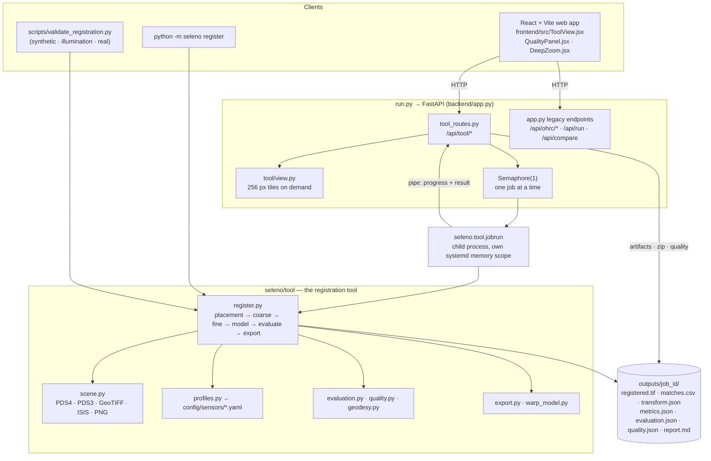
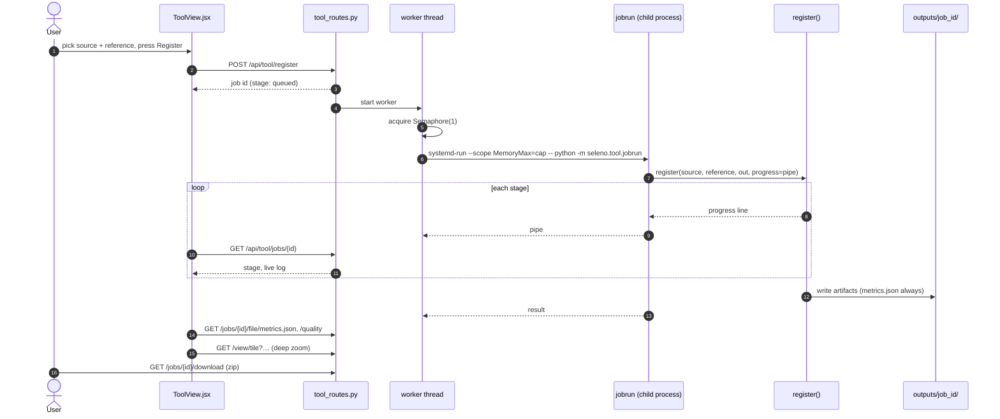
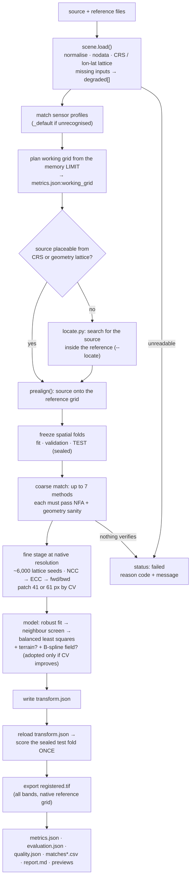

# SELENO — Architecture & Engineering Thesis

**Sub-pixel registration of Chandrayaan-2 images onto lunar reference maps.**
Smart India Hackathon problem SIH26166.

> This document is the technical reference for the `seleno-prototype`
> repository: how to install and run it, and *why* it is shaped the way it is.
> Every claim is grounded in the source tree as of `main@866bcfa`
> (2026-09-27). While writing it, the adversarial suite (35/35) and the unit
> suites (87 tests, 7 modules) were run green under a memory cap. The deeper
> method reference is [`docs/TOOL.md`](docs/TOOL.md).

SELENO takes a Chandrayaan-2 image (the **source**: OHRC, TMC-2 or IIRS) and a
lunar reference map (the **reference**: LRO NAC, SELENE/Kaguya TC, LRO WAC, or
any GeoTIFF). It then:

1. places the source roughly using the spacecraft's own geometry;
2. finds match points evenly spread over the overlap, measured at the source's
   full resolution;
3. fits a transform, adding a terrain (DEM) term and a smooth correction field
   only when they measurably help;
4. writes the **registered image**, the **match points**, and **accuracy
   metrics** measured on points the fit never saw.

When it can't be sure, it says so (`warning` or `failed`, with reasons) instead of
returning a confident wrong answer.

---

## Contents

0. [What changed since 25 September](#0-what-changed-since-25-september)
1. [What the problem asks, and where SELENO answers it](#1-what-the-problem-asks-and-where-seleno-answers-it)
2. [System thesis](#2-system-thesis)
3. [Current results](#3-current-results)
4. [Architecture](#4-architecture)
5. [The registration pipeline](#5-the-registration-pipeline)
6. [Evaluation and quality](#6-evaluation-and-quality)
7. [Memory, jobs and reproducibility](#7-memory-jobs-and-reproducibility)
8. [What you need](#8-what-you-need)
9. [Installation, step by step](#9-installation-step-by-step)
10. [Datasets](#10-datasets)
11. [Running it](#11-running-it)
12. [Understanding the outputs](#12-understanding-the-outputs)
13. [Sensor profiles and adding a new sensor](#13-sensor-profiles-and-adding-a-new-sensor)
14. [Repository layout](#14-repository-layout)
15. [Design trade-offs](#15-design-trade-offs)
16. [Tests and CI](#16-tests-and-ci)
17. [Troubleshooting](#17-troubleshooting)
18. [Known limitations](#18-known-limitations)
19. [Data licences and acknowledgements](#19-data-licences-and-acknowledgements)

---

## 0. What changed since 25 September

| Change | Where | Section |
|---|---|---|
| **Registration quality panel and `quality.json`.** Raw and screened errors with p95, NMAD and 1σ; along- and across-track profiles; spatial-block bootstrap intervals; final-warp validity; the same errors restated in NASA ASP, USGS ISIS and JAXA Kaguya TC reporting forms. | `tool/quality.py`, `frontend/src/QualityPanel.jsx` | §6.3 |
| **Surface metres.** Errors are mapped through the reference CRS onto its datum as local east/north metres. Nominal metres overstated east–west error by 1/cos(latitude) on the WAC mosaic. | `tool/geodesy.py` | §6.4 |
| **Reproducible runs.** The working grid is planned from the memory *limit*, not momentary free memory, and recorded in `metrics.json:working_grid`. App and CLI runs of the same pair give bit-identical transforms. | `tool/register.py` | §7 |
| **Process-isolated web jobs.** Each app registration is its own process (`seleno.tool.jobrun`) in its own systemd memory scope, so the server's heap can't shrink a job's grid, and a job survives a server crash. | `tool/jobrun.py`, `tool_routes.py` | §7 |
| **Thread-safe tiles.** The viewer opens one GDAL handle per thread. A shared handle corrupted deflate decoding and aborted the server. | `tool/scene.py` | §7 |
| **Export safety.** Native export never upsamples a coarser source, and refuses an export needing more than half the free disk. | `tool/export.py` | §5.7 |
| **UI coverage grid follows the sensor profile** (IIRS 12 × 12), no longer a fixed 8. | `ToolView.jsx` | §11.1 |
| **Reference experiment:** Kaguya TC (averaged to 29.6 m) vs WAC for IIRS. RMSE drops from 1.63 to 0.69 source px over the full strip. | `reports/registration_review_20260926/`, `scripts/build_tc_mosaic.py` | §3.2 |

---

## 1. What the problem asks, and where SELENO answers it

| Requirement | What SELENO does | Where to look |
|---|---|---|
| Generic software for Chandrayaan-2 → lunar reference | One tool reads OHRC, TMC-2 and IIRS (PDS4), PDS3, GeoTIFF, PNG/JPEG/JP2 and ISIS cubes. Sensor settings live in YAML profiles | `backend/seleno/tool/`, `config/sensors/` |
| Sub-pixel accuracy of the source image | Correlation at native resolution, refined with ECC and checked forward and backward. Errors are reported in **source pixels** on held-out points | `metrics.json → accuracy`, `quality.json` |
| Uniform distribution of match points | Match points are seeded on an even lattice over the whole overlap. Grid coverage and the share of extrapolated area are both measured | `metrics.json → distribution` |
| Registered product and its match points | `registered.tif` (georeferenced, all bands) and `matches.csv` / `matches_all.csv` | job output folder |
| Evaluation metrics (RMSE, inlier count, inlier ratio) | All three, plus median, p90/p95, % within 1 px, bias, coverage and extrapolation, in source px, reference px and surface metres | `metrics.json`, `quality.json`, `report.md` |
| Illumination variation | Brightness-inversion-aware local correlation, gradient and phase representations, and a learned matcher (DISK + LightGlue) | §5.3 |
| Viewpoint variation | Affine/homography models, a LOLA-DEM terrain-parallax term, and a smooth B-spline correction field | §5.5 |
| Scale variation | Placement from ground sampling distance, area-averaged resampling, and a fine stage at native resolution | §5.2, §5.4 |

---

## 2. System thesis

Four rules govern every design decision in this repository.

> **1. Nothing ever tunes on the test fold.** A spatial test fold is sealed
> before matching starts. Method choice, correlation-patch choice, model terms,
> ECC adoption and refits use only the fit and validation cells. The final
> model is written to `transform.json`, reloaded, and scored once.

> **2. Failure is a first-class outcome.** `metrics.json` always exists. A run
> that cannot be trusted says `failed` with one of five reason codes, or
> `warning` with the gates it missed. A confident wrong answer is the worst
> possible output.

> **3. Measured, not assumed.** Matcher ordering, the shadow-aware handling of
> polar scenes, the IIRS spectral window, and the decision to refuse ~180° Sun
> changes all come from recorded experiments (`reports/`, `results/`). Every
> missing input (no geometry, no Sun parameters, no DEM) is recorded under
> `degraded`, and the run continues with reduced capability.

> **4. Per-sensor behaviour is data, not code.** Adding a sensor is a YAML file
> in `config/sensors/`, not a patch to the pipeline.

The project grew in phases. The early OHRC-to-OHRC illumination study
(`seleno/ohrc/`, `illumination.py`, `registration.py`; the **Phase 2 study** tab)
is retained for its evidence. The current deliverable is the **Phase 7
registration tool** (`seleno/tool/`), which registers arbitrary file pairs and
is what the CLI, the API and the main web tab all drive.

---

## 3. Current results

### 3.1 Final validation run (25 September)

These come from the final validation run of 2026-09-25. The full report is
[`reports/validation_20260925/REPORT.md`](reports/validation_20260925/REPORT.md)
and the one-table summary is
[`deck_summary.md`](reports/validation_20260925/deck_summary.md).

Errors are measured on **held-out check points**: sealed test points that no fit
or selection step ever used.

| Pair | Source px RMSE (median) | Reference px RMSE | Inliers / ratio | Model terms |
|---|---:|---:|---:|---|
| OHRC → LRO NAC | 3.84 (3.09) | 1.06 (≈ 1.06 m) | 1,259 / 97.8% | affine + terrain |
| TMC-2 → SELENE TC (evening) | 2.34 (1.39) | 1.75 | 1,249 / 96.4% | affine + field |
| IIRS 2025-07-29 → LRO WAC | 1.87 (1.24) | 1.62 | 474 / 93.9% | affine + field |
| IIRS 2024-01-20 → LRO WAC | 1.31 (0.74) | 1.19 | 1,256 / 99.3% | affine + field |

- **Known-truth controls:**
  - Synthetic images: 7 of 9 accepted, 0.00–0.18 px error for the accepted ones.
  - Real LROC NAC pairs with 50–90° of Sun change: all 9 registered with
    0.19–0.55 px error.
  - All three 180° pairs and both different-ground negatives were correctly
    refused.
- **Honest status:** sub-pixel accuracy in *source* pixels is **not yet reached
  on the real Chandrayaan-2 pairs**, and every real pair returns `warning`. For
  OHRC the reference is the limit: one NAC pixel spans 4.17 OHRC pixels. See §18.

### 3.2 Reference experiment (26 September)

[`reports/registration_review_20260926/REPORT.md`](reports/registration_review_20260926/REPORT.md)
reviewed an IIRS → WAC result against published NASA, USGS and JAXA practice.
It then reran the same IIRS strip (`20240119T0318228416`) against a sharper
reference: the Kaguya TC morning map, averaged 4 × 4 to 29.6 m. Same settings
(IIRS profile defaults), same 5.5 GB cap, full strip (37–72° S):

| Full strip | WAC 100 m | **TC averaged → 29.6 m** |
|---|---:|---:|
| All held-out RMSE [95% block bootstrap] | 1.63 [1.31–1.97] px | **0.69 [0.57–0.82] px** |
| Screened RMSE / median | 1.31 / 0.96 px | **0.61 / 0.40 px** |
| Below 1 source px (screened) | 53.9% | **90.8%** |
| Surface RMSE (screened) | 90.6 m | **47.4 m** |
| Precision gates: RMSE, p90, ≥95% < 1 px, bias | ✗ ✗ ✗ ✓ | **✓ ✓ ✗ ✓** |

- A matched-resolution, better-controlled reference cuts random scatter 2.5×.
- The across-detector bias seen against WAC disappears, which points at the
  reference rather than the IIRS geometry.
- Two gates still fail: 90.8% < 95% below one pixel, and the legacy cell-support
  gate (left unchanged on purpose).
- TC at its **native 7.4 m** fails: the fine stage would upsample the 55 m
  source 7.4×.
- This is matcher consistency against TC, **not independent accuracy**.

---

## 4. Architecture

### 4.1 High-level view

Three front doors (the web app, the HTTP API and the CLI) all reach one entry
point, `seleno.tool.register.register()`, which writes one artifact set.



**Reading the diagram.** The CLI, the validation harness and the web app all
run the same `register()` and produce the same files, so a number in the UI is
a number from the CLI. The server never runs a registration in its own process.
It spawns `jobrun` in a separate memory scope and streams the pipeline's own
stage log back over a pipe (§7).

### 4.2 One web registration, end to end



---

## 5. The registration pipeline



### 5.1 Reading any input

`tool/scene.py` reads PDS4 (pass the `.xml` label), PDS3 (`.lbl`), GeoTIFF,
ISIS `.cub` and plain images into one normalised `Scene`, with lazy windowed
reads so a 6 GB mosaic is never loaded whole. Nothing about ISRO geometry,
`.spm` Sun parameters or refined corners is assumed. Every absence is recorded
in `Scene.degraded`. IIRS cubes are collapsed into a single matching band by
`tool/spectral.py`. The window comes from the IIRS profile (0.8–1.6 µm, up to
48 bands) and stays clear of thermal contamination beyond ~2.5 µm. The export
still keeps **all** 256 bands.

### 5.2 Placement

With a map-projected reference, the source's own geometry (CRS, or the per-pixel
lon/lat lattice shipped with Chandrayaan-2 products) puts it on the reference
grid. Nothing is searched blindly. When nothing places it, such as two plain
PNGs or two products with lattices and no CRS, `tool/locate.py` finds where the
source lies inside the reference first. An OHRC frame is 2.6 × 22 km, so
assuming both images start at the same corner was never an option.

### 5.3 Coarse matching

`tool/methods.py` runs up to seven candidates: dense NCC, DISK + LightGlue
(when the weights are available), SIFT, SIFT on gradients, SIFT on phase
congruency, AKAZE and ORB. **The order is measured, not preferred:**

| Pair character | Tried first | Why |
|---|---|---|
| anti-correlated brightness (e.g. TMC-2 vs SELENE) | dense NCC | every sparse matcher failed on that pair |
| same sensor | learned matcher | best in the reconciled Phase 2 benchmark |
| otherwise | dense NCC, then learned | |

Every candidate still runs. The order only decides what gets tried first, never
what gets believed. A candidate survives only if `seleno/verify.py` accepts it:
a robust fit, an **a-contrario NFA significance test** (could this agreement have
happened by chance?), and degeneracy checks for fold, scale and anisotropy.

### 5.4 Fine stage

About **6,000 seeds** are laid on an **even lattice** over the predicted overlap,
which is what makes the match distribution uniform by construction rather than
by luck. Each seed is measured at **native resolution**: local NCC, then ECC
refinement, then a forward–backward consistency check. The correlation patch
(41 or 61 px) is chosen per pair by cross-validation on fit cells. The
native-resolution set replaces the coarse set only if it passes every match
quality gate that the coarse set passed.

### 5.5 Model

Robust fit → neighbour-consistency screen → balanced least squares
(`tool/fitting.py`), so heavily textured regions can't dominate. Two optional
terms are each **adopted only if they predict held-out cells better**:

- **Terrain parallax** (`tool/terrain.py`). A point `h` metres above the
  reference sphere seen `θ` off nadir lands `h·tan θ` from where the lattice
  says. The term uses the LOLA polar DEM, found automatically.
- **B-spline correction field** (`tool/local_model.py`). One affine can't
  describe a pushbroom strip, because attitude jitter varies along track. On the
  real pairs the residual after the global fit was mostly *systematic*.

Long strips can use per-segment transforms (`--segments`), blended with a C1
smoothstep between band centres (`tool/warp_model.py`) so there are no
brightness seams. A segment model is replaced automatically when a terrain or
field term is adopted.

### 5.6 Evaluation

See §6.

### 5.7 Export

`tool/export.py` composes the complete inverse model (matrix + field +
parallax) with the original geometry and samples each original band **once**
onto the native reference grid. It never enlarges the decimated matching image,
and it never upsamples a coarser source: it writes every N-th reference pixel
instead. It refuses an export that would need more than half the free disk.
`registered.tif`, the previews and the held-out score all go through the same
`warp_model.inverse_points`, so they cannot disagree.

---

## 6. Evaluation and quality

### 6.1 Sealed folds

Fold membership depends only on the initial source working-grid coordinates,
the image shape and a seed. It never depends on a match, a residual or a model
(`tool/evaluation.py`). There are three roles:

| Fold | Used for |
|---|---|
| **fit** | verification, method and model selection, fine-window placement, cross-validation of terrain/field/patch |
| **validation** | ECC adoption and refits only |
| **test** | scored **once**, after `transform.json` is written and reloaded. Never filtered by that transform |

`evaluation.json` stores the sealed test points and a model fingerprint, so
anyone can recompute the RMSE without rerunning anything. Test correspondences
come from the matcher, not from ground truth, so all of them are kept,
including wrong ones, and the score is described accordingly. A
model-independent neighbour screen sets aside isolated mismatches as
non-*check* points. Both the screened ("check point") and unscreened
("held-out") figures are reported.

### 6.2 Acceptance

`status: pass` requires **all** of these, with thresholds fixed before any run:

- source check-point RMSE and p90 below 1 px;
- at least 95% of check points within 1 px;
- bias below 0.5 px;
- at least 12 check points, with at least 80% of held-out points retained;
- at least 50% coverage and at most 25% extrapolation;
- no invalid predictions.

Separately, `acceptance.independently_verified` is only true when independent
control points were supplied (`--ground-truth-directory`, written to
`ground_truth_evaluation.json`) and passed. **Passing the internal gates never
certifies accuracy on real images.**

### 6.3 Quality diagnostics (`quality.json`)

`tool/quality.py` is read-only: it never fits, screens or selects anything, and
it works from the small saved JSON. That lets
`GET /api/tool/jobs/{id}/quality` recompute it for older runs without touching
the rasters. It adds what one global number hides:

- raw beside screened errors, p95, strict thresholds with declared
  denominators, component mean, 1σ, RMS and NMAD;
- error profiles **along and across the strip**, with drift per 1000 px;
- **spatial-block bootstrap** 95% intervals (2,000 replicates, fixed seed);
- **final-warp validity**: orientation folds, area and shear relative to the
  base model, and the size of the non-global correction;
- support: valid-pixel hull fraction, distance to the nearest fit point, and the
  largest gap;
- the same errors in **NASA ASP** (`bundle_adjust`), **USGS ISIS** (`jigsaw`),
  **JAXA Kaguya TC**, CE90/CE95 and SLDEM2015 reporting forms. Each row states
  how its measurement differs.

A diagnostic failure is recorded under `degraded`. It never crashes an otherwise
finished export.

### 6.4 Surface metres

A projected map's nominal pixel is not a ground distance everywhere. The WAC
mosaic is simple cylindrical, so at 60° S a nominal "200 m" error can be 100 m.
`tool/geodesy.py` maps each forward error through the reference CRS's local
Jacobian onto its own datum as east/north metres. On the IIRS review run,
surface RMSE was 0.62–0.70× the nominal figure.

---

## 7. Memory, jobs and reproducibility

Registration of large products is memory-hungry, and memory used to make runs
non-reproducible. Three mechanisms fix that:

1. **The working grid is planned from the memory limit**: the cgroup cap when
   one is set, otherwise physical RAM. It is never planned from momentary free
   memory. The same inputs and settings therefore give the same grid, and
   `metrics.json:working_grid` records it. `working grid capped at N px` is
   expected. `working grid reduced … not directly comparable` means free memory
   fell short even of that plan.
2. **Each web job is its own process.** Inside the server's cgroup, a job used to
   share the cap with whatever the image viewer had cached: after some viewing,
   a job saw 4.3 of 5.8 GB, shrank its grid, and stopped matching the CLI.
   `tool_routes.py` now starts `python -m seleno.tool.jobrun` in **its own**
   `systemd-run --scope` with the same `MemoryMax` when systemd allows it, and
   reads progress over a dedicated pipe. A job also survives a server crash.
3. **One job at a time** (`threading.Semaphore(1)`). Two concurrent jobs each
   planned from what the other left free and could together hit the cap. Later
   submissions wait as `queued`.

With this in place, an app run and a CLI run of the same pair give
**bit-identical transforms**.

The deep-zoom viewer (`tool/view.py`) cuts 256 px tiles on demand from the same
raster the tool reads. `LazyRaster` opens one GDAL handle per thread, because a
single shared handle corrupted deflate decoding under concurrent tile requests.

---

## 8. What you need

| | Minimum | Notes |
|---|---|---|
| OS | Linux (tested on Arch, kernel 7.x). Windows 11 and macOS work for the app | Memory capping with `systemd-run` (§11.0) is Linux only |
| CPU | Any x86-64 | **No GPU needed.** Everything runs on CPU |
| RAM | 8 GB will do small pairs; **16 GB recommended** | A full IIRS → WAC run peaks at about 4.2 GB of process memory, plus disk cache |
| Disk | ~1 GB for the code and bundled data; **~20 GB** for all real datasets; **~5 GB free** for outputs | IIRS outputs are 1.4–1.8 GB each |
| Python | **3.14** (the verified version; CI runs 3.12) | All dependencies ship wheels for CPython 3.14 |
| Node.js | **20.19+** or **22.12+** | Only to build the web UI (Vite 8, React 19) |
| Tools | `git`, `curl`, `unzip` | For the data downloads |
| Internet | Once, on first run | Learned-matcher weights (~50 MB) download automatically |

---

## 9. Installation, step by step

### 9.1 Get the code

```bash
git clone git@github.com:vegadarsiwork/seleno-prototype.git
cd seleno-prototype
```

### 9.2 Create a Python environment and install dependencies

```bash
python3.14 -m venv .venv
source .venv/bin/activate                 # Windows: .venv\Scripts\activate
python -m pip install --upgrade pip

# PyTorch CPU wheels first; this avoids ~2 GB of GPU runtime you don't need
pip install --index-url https://download.pytorch.org/whl/cpu torch torchvision

# everything else
pip install -r requirements.txt
```

Every command below assumes the virtual environment is active and that you are in
the repository root.

### 9.3 Check the install

```bash
PYTHONPATH=backend python -m seleno profiles
```

You should see six sensor profiles: `iirs`, `nac`, `ohrc`, `selene_tc`, `tmc2`
and `wac`. On Windows (PowerShell), set the path first with
`$env:PYTHONPATH="backend"`.

### 9.4 Build the web interface

```bash
cd frontend
npm ci
npm run build
cd ..
```

This writes `frontend/dist/`, which `run.py` serves. Rebuild it whenever
`frontend/src/` changes, or the web app will show an older interface.

### 9.5 Learned-matcher weights (automatic)

On the first registration, kornia downloads the DISK and LightGlue weights
(~50 MB) into `~/.cache/torch/hub/checkpoints/`. Later runs work offline. Both
are Apache-2.0 licensed. SuperPoint/SuperGlue are deliberately not used, because
their weights are licensed for non-commercial use only.

### 9.6 Smoke test (no downloads needed)

```bash
python tests/test_tool.py        # 35 adversarial cases on small generated images
```

It should end with `35 passed, 0 failed, 0 skipped`.

---

## 10. Datasets

### 10.1 Already in the repository (no download)

| Path | What it is | Good for |
|---|---|---|
| `data/fixtures/` | One synthetic source/reference PNG pair | Trying the web app in seconds |
| `data/lroc/` | 14 real LRO NAC pairs with a real Sun change and a known warp (12 positive, 2 negative) | The illumination validation suite |
| `data/pairs/` | Six older OHRC demo pairs (built from an Internet Archive mirror) | The "Phase 2 study" view and legacy regressions |
| `data/manifest.json` | Index of the demo pairs | Required by `run.py` |

With only these you can run the app, all unit tests, and the synthetic and
illumination validation suites. The synthetic suite generates its own images.

### 10.2 Real datasets to download

To reproduce the four real Chandrayaan-2 results you need the files below. Every
path is relative to the repository root. `data/raw/` is git-ignored, so the data
never gets committed.

| # | Dataset | Role | Size | Source | Account? |
|---|---|---|---:|---|---|
| 1 | Chandrayaan-2 **OHRC** calibrated product `ch2_ohr_ncp_20241115T1326321339_d_img_d18` | Source for OHRC → NAC | 1.2 GB | ISRO PRADAN | **yes** |
| 2 | Chandrayaan-2 **TMC-2** calibrated product `ch2_tmc_ncn_20260813T0627378557_d_img_d18` | Source for TMC-2 → SELENE | 1.2 GB | ISRO PRADAN | **yes** |
| 3 | Chandrayaan-2 **IIRS** derived reflectance `ch2_iir_ndi_20250729T0936115604_d_rfl_d18_srd` | Source for IIRS → WAC | 3.4 GB | ISRO PRADAN | **yes** |
| 4 | Chandrayaan-2 **IIRS** derived reflectance `ch2_iir_ndi_20240120T1432235872_d_rfl_d18_srd` | Source for IIRS → WAC | 3.4 GB | ISRO PRADAN | **yes** |
| 5 | **LRO NAC** controlled south-polar mosaic, bin `CM_355`, tile `P892S2250`, 6.3 km crop | Reference for OHRC | 21 MB (≈290 MB read) | NASA PDS | no |
| 6 | **SELENE/Kaguya TC** evening map v4.0 `TCO_MAPe04_S15E141S18E144SC` | Reference for TMC-2 | 302 MB | JAXA DARTS | no |
| 7 | **SELENE/Kaguya TC** morning map v4.0 `TCO_MAPm04_S15E141S18E144SC` | Optional secondary TMC-2 case | 302 MB | JAXA DARTS | no |
| 8 | **LRO WAC** global mosaic, 100 m | Reference for IIRS | 5.96 GB | USGS | no |
| 9 | **LOLA** polar DEM `ldem_875s_5m` | Terrain term for polar sources (OHRC) | 1.84 GB | NASA PDS Geosciences | no |

You don't need all of them. Download only what the pair you want needs:

| To run | You need |
|---|---|
| OHRC → NAC | 1, 5, and 9 (without 9 it still runs, but with no terrain term) |
| TMC-2 → SELENE | 2 and 6 (plus 7 for the morning case) |
| IIRS → WAC | 3 and/or 4, and 8 |

Optional extras:
- The other three OHRC products are used by the "Phase 2 study" view:
  `ch2_ohr_ncp_20211228T2209123959_d_img_d18`,
  `ch2_ohr_ncp_20241115T1525004388_d_img_d18` and
  `ch2_ohr_ncp_20251010T0942085687_d_img_d18`.
- Two more TMC-2 strips:
  `ch2_tmc_ncn_20260809T1606017180_d_img_d18` and
  `ch2_tmc_ncn_20260813T1023298745_d_img_d18`.
- The coarser LOLA DEM `ldem_80s_20m`.
- For the §3.2 reference experiment, Kaguya TC morning tiles mosaicked with
  `scripts/build_tc_mosaic.py` (as a VRT or a block-mean GeoTIFF).

### 10.3 Chandrayaan-2 products from ISRO PRADAN (needs an account)

Chandrayaan-2 data is distributed by ISSDC through **PRADAN**,
<https://pradan.issdc.gov.in/ch2/>. It can't be downloaded anonymously.

1. Register for a PRADAN account and log in.
2. Open the Chandrayaan-2 archive and choose the instrument:
   - **OHRC** and **TMC-2**: the *calibrated* products (`…_d_img_d18`).
   - **IIRS**: the *derived* reflectance products (`…_d_rfl_d18_srd`).
3. Search for the product IDs in §10.2 and download them. Each product arrives as
   one `.zip`. PRADAN can also generate a Python download script from your
   logged-in session that fetches your selection and resumes interrupted
   downloads.
4. Unpack each product as shown below. The layout matters, because the tool looks
   for each product's geometry and backplane files next to its label.

```bash
# OHRC: keep the product's own folder tree
mkdir -p data/raw/ch2/ohrc
unzip -o ch2_ohr_ncp_20241115T1326321339_d_img_d18.zip -d data/raw/ch2/ohrc

# TMC-2: keep the product's own folder tree
mkdir -p data/raw/ch2/tmc2/extracted
unzip -o ch2_tmc_ncn_20260813T0627378557_d_img_d18.zip -d data/raw/ch2/tmc2/extracted

# IIRS: flatten into one folder; only the reflectance cube and the location
# backplane are needed (skip the 3.3 GB radiance cube)
mkdir -p data/raw/ch2/iirs/extracted
for z in ch2_iir_ndi_20250729T0936115604_d_rfl_d18_srd.zip \
         ch2_iir_ndi_20240120T1432235872_d_rfl_d18_srd.zip; do
  unzip -j -o "$z" '*_d_rfl_*' '*_d_loc_*' -d data/raw/ch2/iirs/extracted
done
```

After unpacking, you should have:

```
data/raw/ch2/ohrc/data/calibrated/20241115/ch2_ohr_ncp_20241115T1326321339_d_img_d18.{xml,img}
data/raw/ch2/ohrc/geometry/calibrated/20241115/ch2_ohr_ncp_20241115T1326321339_g_grd_d18.csv
data/raw/ch2/tmc2/extracted/data/calibrated/20260813/ch2_tmc_ncn_20260813T0627378557_d_img_d18.{xml,img}
data/raw/ch2/tmc2/extracted/geometry/calibrated/20260813/ch2_tmc_ncn_20260813T0627378557_g_grd_d18.csv
data/raw/ch2/iirs/extracted/ch2_iir_ndi_20250729T0936115604_d_rfl_d18_srd.{xml,qub,hdr}
data/raw/ch2/iirs/extracted/ch2_iir_ndi_20250729T0936115604_d_loc_d18_ard.{img,hdr}
data/raw/ch2/iirs/extracted/ch2_iir_ndi_20240120T1432235872_d_rfl_d18_srd.{xml,qub,hdr}
data/raw/ch2/iirs/extracted/ch2_iir_ndi_20240120T1432235872_d_loc_d18_ard.{img,hdr}
```

Delete the `.zip` files afterwards if you need the space.

### 10.4 Reference maps and DEM (public, no account)

Run these from the repository root with the virtual environment active. `curl -C -`
resumes a partial download if you run the command again.

```bash
mkdir -p data/raw/nac data/raw/selene data/raw/wac data/raw/lola

# (5) LRO NAC: cut a 6.3 km crop straight out of NASA's 2 GB GeoTIFF with HTTP
#     range reads (~290 MB read, 21 MB written; takes a few minutes)
rio clip "/vsicurl/https://pds.mcp.nasa.gov/data/store/img/lunar_reconnaissance_orbiter/pds4/lroc/lro-l-lroc-5-rdr/LROLRC_2001/EXTRAS/BROWSE/NAC_POLE/NAC_POLE_SOUTH_CM_355/NAC_POLE_SOUTH_CM_355_P892S2250.TIF" \
    data/raw/nac/NAC_CM355_P892S2250_pole_6km.tif \
    --bounds '[-10067, -12086, -3771, -5790]'

# (6, 7) SELENE/Kaguya TC evening and morning maps, 3 x 3 degree tile, .img + .lbl
D=https://darts.isas.jaxa.jp/pub/pds3
for ext in img lbl; do
  curl -fL -C - -o data/raw/selene/TCO_MAPe04_S15E141S18E144SC.$ext \
    $D/sln-l-tc-5-evening-map-v4.0/lon141/data/TCO_MAPe04_S15E141S18E144SC.$ext
  curl -fL -C - -o data/raw/selene/TCO_MAPm04_S15E141S18E144SC.$ext \
    $D/sln-l-tc-5-morning-map-v4.0/lon141/data/TCO_MAPm04_S15E141S18E144SC.$ext
done

# (8) LRO WAC global mosaic, 100 m/px (5.96 GB)
curl -fL -C - -o data/raw/wac/Lunar_LRO_LROC-WAC_Mosaic_global_100m_June2013.tif \
  https://planetarymaps.usgs.gov/mosaic/Lunar_LRO_LROC-WAC_Mosaic_global_100m_June2013.tif

# (9) LOLA south-polar DEM, 5 m/px, .img + .lbl (1.84 GB)
L=https://pds-geosciences.wustl.edu/lro/lro-l-lola-3-rdr-v1/lrolol_1xxx/data/lola_gdr/polar/img
for ext in img lbl; do
  curl -fL -C - -o data/raw/lola/ldem_875s_5m.$ext $L/ldem_875s_5m.$ext
done
```

Expected sizes, as a quick completeness check:

| File | Bytes |
|---|---:|
| `data/raw/nac/NAC_CM355_P892S2250_pole_6km.tif` | ~21 MB (6296 × 6296, uint8) |
| `data/raw/selene/TCO_MAP{e,m}04_S15E141S18E144SC.img` | 301,989,888 each |
| `data/raw/wac/Lunar_LRO_LROC-WAC_Mosaic_global_100m_June2013.tif` | 5,959,263,751 |
| `data/raw/lola/ldem_875s_5m.img` | 1,840,545,792 |

The terrain term finds the DEM by itself at `data/raw/lola/ldem_875s_5m.lbl`,
falling back to `ldem_80s_20m.lbl`. There is nothing to configure.

### 10.5 Final layout

```
data/raw/
├── ch2/
│   ├── ohrc/{data,geometry,browse,miscellaneous}/calibrated/<date>/…
│   ├── tmc2/extracted/{data,geometry,browse,miscellaneous}/calibrated/<date>/…
│   └── iirs/extracted/ch2_iir_ndi_…_{d_rfl_d18_srd.xml|qub|hdr, d_loc_d18_ard.img|hdr}
├── nac/NAC_CM355_P892S2250_pole_6km.tif
├── selene/TCO_MAP{e,m}04_S15E141S18E144SC.{img,lbl}
├── wac/Lunar_LRO_LROC-WAC_Mosaic_global_100m_June2013.tif
└── lola/ldem_875s_5m.{img,lbl}
```

Everything under `data/raw/` shows up in the web app's file picker, labelled
**PRODUCT**.

### 10.6 Using your own images

Any pair of these formats works: GeoTIFF, PNG/JPEG/JP2, PDS4 (`.xml` label with
its data file), PDS3 (`.lbl`/`.img`) and ISIS `.cub`. Either:

- put the files anywhere under `data/raw/`, or
- use the **Upload** box in the web app. It streams files, including a label and
  its data file together, into `data/uploads/`, labelled **UPLOAD**.

Images without georeferencing (plain PNGs) still work. The tool then finds the
source inside the reference by itself; see `--locate` in §11.2.

---

## 11. Running it

### 11.0 Memory safety (read this first on Linux)

Registration of large products is memory-hungry. **`/tmp` is often RAM
(tmpfs)**, so temporary files there also use memory. Uncapped runs on a 15 GB
machine have made the kernel kill the terminal. On Linux, run heavy jobs inside a
memory-capped scope, with two math threads and temporary files on disk:

```bash
mkdir -p outputs/tmp
capped() {
  systemd-run --user --scope -q -p MemoryMax=5500M -p MemorySwapMax=0 \
    env OPENBLAS_NUM_THREADS=2 OMP_NUM_THREADS=2 TMPDIR="$PWD/outputs/tmp" "$@"
}
```

The commands below are written as `capped python …`. Without `systemd-run`
(Windows, macOS), drop `capped` and close other heavy programs. Also:

- Run **one heavy job at a time**.
- The working grid is planned from the memory **limit** (§7), so the same inputs
  and settings give the same result on every run.
- The web app runs one registration at a time, each in its own process and
  memory scope; further submissions wait as `queued`.

### 11.1 The web app

```bash
capped python run.py                # opens http://127.0.0.1:8000
capped python run.py --port 8001    # if 8000 is taken
capped python run.py --no-browser   # don't open a browser tab
```

Using it:

1. **Registration tool** tab (the default).
2. In **Source**, type part of a name in the filter box, e.g. `ohr_ncp_20241115T1326`
   or `tmc_ncn`, and click the product. Do the same in **Reference**, e.g.
   `NAC_CM355` or `TCO_MAPe04`. The **view** button next to a file opens it at
   full resolution.
3. Set the options, or leave the defaults:
   - **Model**: `auto`, `similarity`, `affine` or `homography`.
   - **Working grid**: size of the coarse grid. "Sensor default" is usually right.
     The published OHRC/TMC-2 results used 2048.
   - **Coverage grid**: N × N cells for the uniformity metric and the held-out
     split. **Sensor default** (the default) uses the source's profile and shows
     the value it resolves to: 12 × 12 for IIRS, 8 × 8 otherwise. The published
     OHRC/TMC-2 results used 12 × 12. The grid changes the fold layout and can
     change the chosen model, so pin it when comparing runs.
   - **Segments**: separate transforms along long strips (6 for OHRC/TMC-2).
   - **ECC sub-pixel polish**: kept only if it improves a separate validation set.
4. Press **Register**. The **Run** log streams each stage live: placement,
   matcher candidates, fine stage and model choice. OHRC → NAC takes about 2 min,
   TMC-2 → SELENE about 5 min, and IIRS → WAC 3–5 min.
5. **Result**:
   - The **Registration quality** panel comes first: whether quality acceptance
     failed and why, all-held-out RMSE / p95 / fraction below one source pixel
     with 95% spatial-block bootstrap intervals, raw and screened error tables
     in native source pixels and in surface east/north metres on the reference
     datum, the same errors restated in NASA ASP, USGS ISIS and JAXA Kaguya TC
     reporting forms, error profiles along and across the strip, fit-point
     support and a final-warp validity check (§6.3).
   - **Run details** (collapsed) holds the **Metrics** table: status and
     reasons, method, inliers, inlier ratio, check points, source / reference /
     surface RMSE, median and p90, correlation patch, terrain term, coverage and
     extrapolated area.
   - **Degraded capability** lists every assumption the tool could not verify.
   - The viewer tabs are **Zoom & compare**, **Match lines**, **Before / after**
     and **Composite**. Zoom & compare shows both images at full resolution with
     tie points in green.
6. **Download outputs** gives a zip of every artifact from that run (§12).

The **Phase 2 study** tab is the earlier OHRC-to-OHRC illumination study. It
needs the four OHRC products under `data/raw/ch2/ohrc`, or `SELENO_OHRC_ROOT`
pointing at them.

**Working on the UI:** `cd frontend && npm run dev` serves the live source at
http://127.0.0.1:5173 and forwards `/api` to the backend on port 8000. Start
`run.py` first.

### 11.2 Command line

```bash
PYTHONPATH=backend capped python -m seleno register \
    --source <source file> --reference <reference file> --out outputs/cli [options]
```

| Option | Meaning |
|---|---|
| `--model auto\|similarity\|affine\|homography` | Transform family (`auto` chooses from the data) |
| `--max-side N` | Working-grid size cap; defaults to the source's sensor profile |
| `--grid N` | N × N grid for tie-point distribution and the coverage metric |
| `--segments N` | Per-segment transforms along a long strip; `0` disables. Replaced automatically when a terrain or field term is adopted |
| `--no-fine` | Skip the native-resolution fine stage (faster, less accurate) |
| `--fine-tiles N` | Cap on native tiles; `0` = as many as needed (max 400) |
| `--no-subpixel` | Skip the ECC polish |
| `--locate auto\|force\|off` | Search for the source inside the reference when no map projection places it |
| `--json` | Also print `metrics.json` to the terminal |
| `--quiet` | Less logging |

The four published cases, exactly as validated:

```bash
# OHRC -> LRO NAC                                          (~2.5 min)
PYTHONPATH=backend capped python -m seleno register \
  --source data/raw/ch2/ohrc/data/calibrated/20241115/ch2_ohr_ncp_20241115T1326321339_d_img_d18.xml \
  --reference data/raw/nac/NAC_CM355_P892S2250_pole_6km.tif \
  --out outputs/cli --max-side 2048 --grid 12 --segments 6

# TMC-2 -> SELENE TC evening map                           (~5 min)
PYTHONPATH=backend capped python -m seleno register \
  --source data/raw/ch2/tmc2/extracted/data/calibrated/20260813/ch2_tmc_ncn_20260813T0627378557_d_img_d18.xml \
  --reference data/raw/selene/TCO_MAPe04_S15E141S18E144SC.lbl \
  --out outputs/cli --max-side 2048 --grid 12 --segments 6

# IIRS -> LRO WAC (sensor defaults; writes a ~1.4 GB, 256-band GeoTIFF)   (~3 min)
PYTHONPATH=backend capped python -m seleno register \
  --source data/raw/ch2/iirs/extracted/ch2_iir_ndi_20250729T0936115604_d_rfl_d18_srd.xml \
  --reference data/raw/wac/Lunar_LRO_LROC-WAC_Mosaic_global_100m_June2013.tif \
  --out outputs/cli

# IIRS 2024 -> LRO WAC                                     (~4.5 min, ~1.8 GB output)
PYTHONPATH=backend capped python -m seleno register \
  --source data/raw/ch2/iirs/extracted/ch2_iir_ndi_20240120T1432235872_d_rfl_d18_srd.xml \
  --reference data/raw/wac/Lunar_LRO_LROC-WAC_Mosaic_global_100m_June2013.tif \
  --out outputs/cli
```

Each run prints its stages and ends with `wrote : outputs/cli/<job_id>`. The
process exits with 0 when the registration completes, even when its status is
`warning`.

For PDS products, always pass the **label** (`.xml` for PDS4, `.lbl` for PDS3),
not the `.img`. The label carries the geometry.

### 11.3 HTTP API

`run.py` also serves a JSON API under `/api/tool`. The web app uses exactly these
endpoints.

| Method and path | Purpose |
|---|---|
| `GET /api/tool/files` | Selectable inputs, each labelled `product`, `fixture` or `upload` |
| `GET /api/tool/profiles` | Loaded sensor profiles |
| `POST /api/tool/register` | Start a run; returns `{"job": "<id>"}` |
| `GET /api/tool/jobs` / `GET /api/tool/jobs/{id}` | Job list, or one job's state, live log and metrics |
| `GET /api/tool/jobs/{id}/quality` | Quality diagnostics, recomputed from saved JSON (works on older runs) |
| `GET /api/tool/jobs/{id}/artifacts` | Which artifacts exist for a job |
| `GET /api/tool/jobs/{id}/file/{name}` | One artifact (`metrics.json`, `registered.tif`, `matches.csv`, …) |
| `GET /api/tool/jobs/{id}/download` | Every artifact as a zip |
| `GET /api/tool/view/info` · `/view/tile` · `/view/region` | Deep-zoom viewer: raster info, 256 px tiles, regions |
| `PUT /api/tool/upload?batch=…&name=…` | Stream one file into `data/uploads/` |

Example:

```bash
curl -s -X POST http://127.0.0.1:8000/api/tool/register \
  -H 'content-type: application/json' \
  -d '{"source": "data/fixtures/synthetic_source.png",
       "reference": "data/fixtures/synthetic_reference.png",
       "model": "auto", "max_side": 1024, "grid": 8, "segments": 0, "subpixel": true}'
# -> {"job": "ab12cd34ef56", ...}
curl -s http://127.0.0.1:8000/api/tool/jobs/ab12cd34ef56 | python -m json.tool | head
curl -s -o result.zip http://127.0.0.1:8000/api/tool/jobs/ab12cd34ef56/download
```

Paths are relative to the repository root. The server refuses paths outside it.

`backend/app.py` also keeps the earlier prototype's endpoints:
`/api/health`, `/api/config`, `/api/ohrc/*` (products, overlaps, tiles,
windows, alignment), `/api/register`, `/api/compare`, `/api/run`,
`/api/pair-preview`, `/api/image/…`, `/api/pair-image/…` and `/api/docs-md/…`.
They drive the Phase 2 study tab and the six legacy manifest pairs.

### 11.4 Validation suites (reproduce the report)

```bash
mkdir -p outputs/validation/tmp
for suite in synthetic illumination real; do
  capped python -u scripts/validate_registration.py --suite "$suite" \
    --out reports/my_validation --artifacts outputs/validation
done
capped python scripts/summarize_validation.py --out reports/my_validation
```

| Suite | Needs | Runtime | What it checks |
|---|---|---|---|
| `synthetic` | nothing (it generates images) | ~1 min | 9 cases with exact known transforms: translation, rotation, scale with and without metadata, gamma, brightness inversion, 4× georeferenced |
| `illumination` | `data/lroc/` (in the repo) | ~5 min | 12 real NAC pairs with 50–180° Sun change and a known warp, plus 2 negative pairs that must be refused |
| `real` | §10.2 datasets | ~15 min | The four Chandrayaan-2 pairs above, plus the morning-SELENE case |

- **Outputs:** `real.json`, `synthetic.json`, `illumination.json`, per-case logs
  and `evidence/`. The summarizer writes `deck_summary.md/.csv`,
  `report_tables.md` and `summary.json`.
- **Exit code:** nonzero when any case misses the fixed acceptance gates. That is
  not a crash.
- **One case only:** use `--case <name>`. Note that this overwrites that suite's
  `.json` with just that case.
- **Independent control points:** `--ground-truth-directory <dir>` accepts
  `<case>.json` control-point manifests for real pairs, scored into
  `ground_truth_evaluation.json`.

To compare one source against several references (as in §3.2), use
`reports/registration_review_20260926/compare_references.py`.

---

## 12. Understanding the outputs

Every run writes a folder `outputs/<…>/<job_id>/`. Even a failed run writes
`metrics.json` and `report.md`, saying why.

| File | What it is |
|---|---|
| `registered.tif` | The source resampled onto the reference grid at the reference's native resolution, georeferenced, cropped to the registered footprint. **All source bands** (256 for IIRS), with NaN as nodata |
| `matches.csv` | The delivered match points, evenly thinned with a per-cell quota: `src_x, src_y, ref_x, ref_y, confidence, inlier`. Coordinates are original source pixels and full-resolution reference pixels |
| `matches_all.csv` | Every fit-stage match before thinning, including rejected ones (`inlier=0`) |
| `tiepoints.npz` | All native-resolution tie points, with their fit/validation/test labels |
| `transform.json` | The complete model: matrix, frame, and optional `local_field` (B-spline) and `parallax` (DEM term). Export, previews and scoring all use exactly this |
| `metrics.json` | Every number: status and reasons, matches, accuracy, distribution, the method trials, the fine stage, each cross-validation decision, and `working_grid` |
| `evaluation.json` | The sealed test points and the model fingerprint, so anyone can recompute the RMSE |
| `quality.json` | The read-only quality diagnostics of §6.3 |
| `ground_truth_evaluation.json` | Only when independent control points were supplied |
| `report.md` | Human-readable summary of the run |
| `overlay.png`, `registered.png`, `source.png`, `reference.png`, `preview.json` | Previews used by the web viewer |

### Reading `metrics.json`

| Key | Meaning |
|---|---|
| `status` | `pass`: every accuracy and coverage gate met. `warning`: a transform was produced but a gate failed (reasons listed). `failed`: no trustworthy transform |
| `reason` / `acceptance.reasons` | For `warning`: which gates failed, in plain words |
| `reason` + `message` (when `failed`) | `reason` is one of `unreadable_input`, `no_overlap`, `insufficient_matches`, `verification_failed`, `degenerate_transform`; `message` explains it |
| `matches.candidates`, `.inliers`, `.inlier_ratio` | Inlier count and ratio |
| `accuracy.check_point_source_rmse_px` | **Headline**: RMSE on held-out check points, in source pixels |
| `accuracy.check_point_source_{median,p90,within_1,bias}_px` | Distribution of that error |
| `accuracy.check_point_reference_*`, `rmse_m` | The same errors in reference pixels and metres |
| `accuracy.held_out_*` | Every held-out point, including the few isolated mismatches the check-point screen set aside |
| `accuracy.subpixel` | Whether check-point source RMSE is below one source pixel |
| `acceptance.independently_verified` | True only when independent control points were supplied and passed |
| `distribution.coverage_fraction` | Share of usable grid cells holding a tie point |
| `distribution.extrapolation_fraction` | Share of usable area outside the tie-point hull, where the transform is extrapolated |
| `fine_stage.patch_px`, `.patch_cv` | Which correlation patch (41 or 61 px) cross-validation chose, and the scores behind it |
| `fine_stage.model_fit` | Cross-validation tables for the terrain term and the correction field |
| `working_grid` | The planned grid and the memory limit it was planned from (§7) |
| `degraded` | Every assumption the run could not verify, and any diagnostic that failed |

The acceptance gates are listed in §6.2. They measure internal consistency on
unseen points. Certified accuracy needs independent control points (§11.4).

---

## 13. Sensor profiles and adding a new sensor

Each sensor has a YAML file in `config/sensors/`: `ohrc`, `tmc2`, `iirs`, `nac`,
`selene_tc`, `wac`, plus `_default` for anything unrecognised. A profile sets:
- ground sampling distance and bit depth;
- normalisation (and its scope: per window for OHRC, whose column means swing by
  30–45 DN across the swath), CLAHE, and shadow and texture thresholds;
- the expected geolocation error, which bounds the search radius (4.6 km for
  OHRC, as measured in `reports/GEOLOCATION.md`);
- registration defaults (`max_side`, `grid`, optional `fine_patch`);
- for IIRS, the spectral window used to build a single matching band from the
  256-band cube.

Matching is deliberately loose. A file with no instrument identifier gets
`_default`, and the run reports reduced capability instead of guessing.

To add a sensor, copy `_default.yaml` to `<name>.yaml` and fill in its values.
Then check it is loaded:

```bash
PYTHONPATH=backend python -m seleno profiles
```

---

## 14. Repository layout

```
seleno-prototype/
├── run.py                        start the web app + API (http://127.0.0.1:8000)
├── requirements.txt
├── backend/
│   ├── app.py                    FastAPI app; serves frontend/dist; legacy /api/* endpoints
│   ├── tool_routes.py            /api/tool/* (files, register, jobs, quality, artifacts, view, upload)
│   └── seleno/
│       ├── __main__.py           CLI: python -m seleno register | profiles
│       ├── verify.py             robust verification, NFA significance, degeneracy checks
│       ├── matchers.py           SIFT variants, AKAZE, ORB, DISK+LightGlue
│       ├── spatial.py            spatially distributed selection; valid-pixel support
│       ├── phasecong.py          phase congruency + RIFT2-style descriptor
│       ├── tool/                 ★ THE REGISTRATION TOOL ★
│       │   ├── register.py       the pipeline: placement, coarse, fine stage, model, metrics
│       │   ├── scene.py          readers: PDS4/PDS3/GeoTIFF/cubes, lazy per-thread windowed reads
│       │   ├── methods.py        candidate methods, measured ordering, dense NCC, refinement
│       │   ├── locate.py         finds the source inside the reference when nothing places it
│       │   ├── fitting.py        robust fits with bounded influence from textured regions
│       │   ├── local_model.py    B-spline correction field
│       │   ├── terrain.py        LOLA DEM terrain-parallax term
│       │   ├── warp_model.py     applying the complete model (matrix + segments + field + parallax)
│       │   ├── evaluation.py     sealed folds, check points, error statistics, acceptance
│       │   ├── quality.py        read-only quality diagnostics (quality.json)
│       │   ├── geodesy.py        local surface east/north metres on the reference datum
│       │   ├── export.py         registered GeoTIFF export (all bands, native grid)
│       │   ├── coordinates.py    pixel-centre conventions; sampling.py: nodata-aware sampling
│       │   ├── spectral.py       IIRS cube -> matching band
│       │   ├── profiles.py       sensor profiles loader
│       │   ├── view.py           deep-zoom tiles for the viewer
│       │   └── jobrun.py         one web registration as its own process
│       ├── ohrc/ …               dataset layer for the Phase 2 OHRC study
│       ├── illumination.py, dem.py, registration.py, pipeline.py, …   earlier study pipeline
│       └── train/                LightGlue fine-tuning dataset (docs/TRAINING.md)
├── frontend/                     React 19 + Vite 8 web UI (src/, built into dist/)
├── config/sensors/*.yaml         sensor profiles
├── scripts/
│   ├── validate_registration.py  validation suites (synthetic / illumination / real)
│   ├── summarize_validation.py   report and deck tables from a validation run
│   ├── build_tc_mosaic.py        Kaguya TC tiles → VRT or block-mean GeoTIFF reference
│   ├── fetch_lroc_pairs.py       rebuild data/lroc/ from NASA PDS
│   ├── verify_reference_data.py  sanity checks on the LOLA DEM and WAC mosaic
│   ├── build_footprint_index.py, discover_pairs.py   footprint index and pair search
│   └── …                         earlier experiments (illumination study, benchmarks, training)
├── tests/                        unit and adversarial tests (§16)
├── data/                         bundled demo data (§10.1); data/raw/ is yours to fill (§10.2)
├── docs/                         TOOL.md (technical reference), DATA_INVENTORY.md, AUDIT.md, TRAINING.md
├── reports/                      validation reports, the 26 Sep review, earlier phase reports
├── results/                      recorded experiment results
└── outputs/                      run outputs (git-ignored)
```

Further reading:
- [`docs/TOOL.md`](docs/TOOL.md): the full technical reference (accuracy
  definitions, fine stage, terrain term, memory, CLI, API).
- [`docs/DATA_INVENTORY.md`](docs/DATA_INVENTORY.md): everything measured about
  the datasets and archives.
- [`reports/validation_20260925/REPORT.md`](reports/validation_20260925/REPORT.md):
  the latest validation.
- [`reports/registration_review_20260926/REPORT.md`](reports/registration_review_20260926/REPORT.md):
  the quality review against NASA/USGS/JAXA practice, and the TC-vs-WAC
  experiment.
- `SESSION_PPT_HANDOFF.md`: presentation material.
- `ASSUMPTIONS.md`: label defects and assumptions in the earlier OHRC study.

---

## 15. Design trade-offs

| Decision | Alternative considered | Why the current design won |
|---|---|---|
| **Seal the test fold before matching** | Score on the fit's own residuals | Self-consistency can look excellent for a completely wrong model. Only unseen points say anything. |
| **Folds from source coordinates + seed only** | Folds chosen after matching | A fold that depends on matches or residuals leaks the answer into the score. |
| **Report `warning` / `failed` with reasons** | Always return a transform | A confident wrong registration is worse than a refusal. |
| **Even lattice seeding** | Rank matches by descriptor confidence | Confidence clusters matches on one or two crater rims; the fit then extrapolates badly everywhere else. |
| **Run every matcher; order only by measurement** | Pick one matcher | Which method works depends on the regime (illumination, sensor, brightness inversion), as measured in Phase 2. |
| **NFA significance test** | Fixed inlier-count threshold | Repeated crater texture produces many plausible matches; NFA asks whether the agreement could be chance. |
| **Terrain / field terms adopted only by CV** | Always fit the richest model | Richer models manufacture confident nonsense on few points. |
| **Score the reloaded `transform.json`** | Score the in-memory model | Guarantees the delivered file, not an internal variant, is what was measured. |
| **Plan memory from the limit** | Plan from free memory | Free memory varies run to run; the limit does not, so results are reproducible. |
| **One process + scope per web job** | Run in the server process | The server's heap shrank the job's grid and broke app/CLI parity. |
| **Surface metres via the CRS Jacobian** | Nominal pixel size | Nominal pixels overstate east–west error by 1/cos(latitude). |
| **Matched-resolution reference** | Finest available reference | Native 7.4 m TC fails: the fine stage upsamples the 55 m source. Averaged 29.6 m TC halves the error. |
| **DISK + LightGlue** | SuperPoint / SuperGlue | Apache-2.0 weights; SuperPoint/SuperGlue are non-commercial only. |
| **Sensor behaviour in YAML** | `if sensor == …` branches | Adding a sensor is a data change, not a pipeline patch. |

---

## 16. Tests and CI

```bash
capped python tests/test_tool.py            # 35 adversarial cases (bad files, no overlap, mirrored, ...)
capped python tests/test_ohrc_dataset.py    # 28 checks against the OHRC archive; skips if absent
for t in test_native_export test_matcher_refinement test_evaluation_acceptance \
         test_validation_fixes test_dense_model test_geometry_terrain test_quality_metrics; do
  PYTHONPATH=backend capped python -m unittest tests.$t
done
```

| Suite | Covers |
|---|---|
| `test_tool.py` | 35 adversarial end-to-end cases: unreadable files, no overlap, mirrored and degenerate inputs, viewer tiles |
| `test_quality_metrics.py` | quality diagnostics, bootstrap, profiles, surface metres, warp validity, agency forms; web jobs run in a child process, queue, and report a killed child |
| `test_evaluation_acceptance.py` | sealed folds, check points, acceptance gates |
| `test_native_export.py` | native export, pixel-centre conventions, no upsampling of a coarser source, per-thread raster reads |
| `test_dense_model.py`, `test_geometry_terrain.py` | dense model, geometry lattice, terrain term |
| `test_matcher_refinement.py`, `test_validation_fixes.py` | matching, refinement, audit regressions |
| `test_ohrc_dataset.py` | the OHRC archive layer; skips when the data is absent |

On 2026-10-04, the 35 adversarial cases and the 87 unit tests in the seven
`unittest` modules all passed under a 4 GB cap.

**CI** (`.github/workflows/tests.yml`, Python 3.12, cached matcher weights)
runs the adversarial tests, the audit regression tests, the archive dataset
tests and a CLI smoke test.

---

## 17. Troubleshooting

| Symptom | Cause and fix |
|---|---|
| The terminal or desktop freezes, or processes get killed during a run | Out of memory. Use `capped` (§11.0), run one job at a time, and keep `TMPDIR` on disk |
| `address already in use` on start | Another program has port 8000. Use `python run.py --port 8001` |
| The web app looks old or lacks the quality panel | `frontend/dist` is stale. Run `cd frontend && npm ci && npm run build` |
| `data/manifest.json is missing` | Run from the repository root; that file is committed |
| The first run hangs at "Loaded LightGlue model", or fails offline | The weights (~50 MB) download on first use. Connect once, or copy `~/.cache/torch/hub/checkpoints/` from another machine |
| `FutureWarning: torch.jit.script is not supported in Python 3.14+` | Harmless |
| `NotGeoreferencedWarning` | Harmless for PNG/JPEG inputs; they have no map coordinates |
| `working grid capped at N px (asked for M)` | Expected. The grid is planned from the memory limit, identically on every run |
| `working grid reduced to N px … not directly comparable` | Free memory was short of the plan; the run is valid but not comparable with others. Free memory and rerun |
| An app run differs from a CLI run of the same pair | Check the coverage grid and working grid match (`metrics.json:working_grid`); both change the fold layout |
| The TMC-2 morning-SELENE case is `failed` | Expected. The low-Sun morning map doesn't match this high-Sun strip well enough, so the tool refuses |
| IIRS runs take minutes and write 1.4–1.8 GB | Expected. The export keeps all 256 bands at WAC resolution |
| `python -m seleno`: `No module named seleno` | Prefix `PYTHONPATH=backend`, or run from inside `backend/` |
| A PDS product registers badly or without geometry | Pass the `.xml`/`.lbl` label, not the `.img`, and keep the product's folder tree (§10.3) |

---

## 18. Known limitations

- **Sub-source-pixel accuracy is not reached on the real pairs** (1.3–3.8 source
  px RMSE against the 25 Sep references).
  - OHRC → NAC is limited by the reference: 1 NAC px = 4.17 OHRC px. It reaches
    about 1 NAC px (≈ 1 m).
  - IIRS 2024 is closest: median 0.74 px.
  - Against a matched-resolution Kaguya TC reference, IIRS passes the RMSE, p90
    and bias gates but not "95% below 1 px" (90.8%) (§3.2).
- **Extrapolation:** 32–57% of each real overlap lies outside the tie points by
  the legacy grid-cell estimate. That estimate is biased on thin strips: the
  valid-pixel hull figure is reported beside it, but the legacy gate still
  drives acceptance.
- **The terrain term needs a DEM.** Only the polar LOLA DEMs are wired in, so the
  equatorial TMC-2 and IIRS scenes run without it.
- **Very large Sun changes (~180°)** are refused, not solved.
- **No surveyed control points** exist for the real pairs, so accuracy there is
  measured on held-out matches. External controls can be supplied with
  `--ground-truth-directory`.
- **Web jobs run one at a time.** Later submissions queue.
- **The fine stage measures at the reference's resolution.** A much finer
  reference must be pre-averaged (`build_tc_mosaic.py`). Choosing a common
  resolution automatically is future work.
- **Chandrayaan-2 downloads need a PRADAN account** and can't be scripted from
  this repository.

---

## 19. Data licences and acknowledgements

- **Chandrayaan-2** (OHRC, TMC-2, IIRS): © ISRO, distributed by ISSDC through
  PRADAN. Use is subject to ISRO's terms; please acknowledge ISRO
  (<https://pradan.issdc.gov.in/ch2/ack.xhtml>).
- **LRO LROC NAC and WAC** (NASA / Arizona State University): public NASA PDS
  data. The south-polar controlled mosaics are described in Archinal et al.
  (2023), LPSC 54, #2333.
- **LRO LOLA** DEMs: NASA PDS Geosciences Node, public.
- **SELENE/Kaguya TC** maps: JAXA, distributed through DARTS, public.
- **DISK and LightGlue** weights (through kornia): Apache-2.0.

This is a non-commercial prototype for the Smart India Hackathon (SIH26166). It
claims no rights over any of the imagery.

---

*This document reflects `main@866bcfa`. Diagrams are authored in Mermaid and
render natively on GitHub. When the code changes, update the affected section
and its diagram together — a stale diagram is worse than none.*
