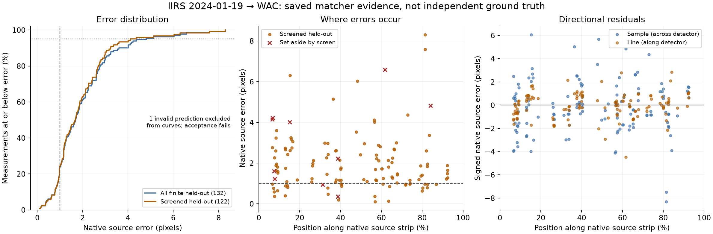

# Registration quality review: Seleno, NASA and JAXA

Research and code review: **26 September 2026**. Repository inspected at `bf5fb98d89c1`. Scope: the registration tool shown in the supplied screenshots, its saved results, and published planetary mapping methods. This is a research report and an analysis of existing evidence; alternative registration pipelines were not run.

**Assessment**

Your concern is supported by the saved results. The registration associated with the screenshots fails the project's own accuracy criteria, and its comparison views make the failure difficult to interpret. However, replacing the existing metrics with a single SSIM or correlation score would weaken the assessment. The project already has useful held-out evaluation; the priorities are independent reference checks, clearer units, better spatial diagnostics, and improved reference/geometry handling.

The most valuable lesson from the NASA and JAXA sources is to connect image measurements to camera geometry, terrain and external reference information, then examine errors by location and direction. Their published numbers measure different things; none establishes that an agency pipeline would achieve a particular accuracy on our IIRS–WAC pair.

**1. What the screenshots and saved artifacts actually show**

Two local jobs, `3acbdc7cee27` and `499a51341aa5`, match the visible IIRS filename, WAC reference and **206 preview candidates**. Both report identical accuracy. The screenshot does not expose its job ID, so this identifies the matching evidence rather than proving which duplicate the browser displayed. The analysed job was generated at `2026-09-26T11:52:42Z`.

Inputs: IIRS `20240119T0318228416`, 12,485 × 250 detector pixels, 256 bands; WAC global June-2013 mosaic, nominal 100 m projected pixels. The IIRS matching image is a pseudo-pan assembled from 47 reflected-light bands between approximately 0.81 and 1.59 μm. The saved base model is similarity, with an adopted B-spline correction. Thus, the “Single transform” selection does not imply that only a rigid/global correction was applied.

| Evidence for the screenshot-matching pair | Result | Meaning |
|---|---:|---|
| Preview/fit candidates; geometric inliers | 206; 175 (84.95%) | Many mutually consistent fit matches do not establish independent accuracy |
| All held-out observations | 133; one invalid native-source prediction | Invalid prediction causes acceptance to fail |
| Screened held-out observations | 122; 11 set aside | These are matcher measurements, not external ground truth |
| Screened source RMSE / median | 2.357 / 1.673 px | Fails the sub-source-pixel target |
| Screened source p90 / **p95** | 3.228 / **4.106 px** | The tail is substantially worse than the average impression |
| Screened observations strictly below 1 source px | 23.77% | Existing requirement is at least 95% |
| Unscreened source RMSE / p95 | 2.471 / 4.573 px | Statistics over 132 finite predictions; invalid count remains visible |
| Direct forward reference RMSE | 2.601 reference px | About 260.1 **projected map metres**, not measured absolute lunar accuracy |
| Eligible-cell coverage | 65.91% | Cells with fit support, not a percentage of correctly aligned pixels |
| Estimated extrapolation | 72.73% | Eligible grid-cell centres outside the fit-point hull; see caveat below |
| Internal acceptance / independent verification | Failed / unavailable | No independent reference points supplied |

Source: [saved metrics](../../outputs/3acbdc7cee27/metrics.json), [saved evaluation](../../outputs/3acbdc7cee27/evaluation.json), and the portable [evidence summary](evidence_summary.json). RMSE, median and p90 were recomputed from saved native-source observations and predictions and checked against the JSON; p95 is newly calculated. Invalid predictions were counted, not silently discarded. Treating the invalid observation as unsuccessful gives 31/133 = 23.31% below one pixel for the unscreened set.

The directional plot exposes information a match-line display hides. Unscreened sample-direction NMAD is 1.98 source px versus 1.00 px in the line direction. This is evidence of unequal directional scatter, not proof of its cause. The mean bias is only about 0.20 px while RMSE is 2.47 px: simply correcting a global offset cannot remove this scatter. Blank regions between measurements have unknown accuracy.

There are also concrete display problems:

- **Match lines are correspondence links, not residual arrows.** Their lengths include the separation between the two panels. Nearly horizontal green lines cannot establish subpixel alignment. “206 of 206 drawn” counts available preview candidates; it is not 206 independent successful checks.
- **“Before / after” is reference versus registered source.** It does not show the source's alignment before correction, so it cannot demonstrate improvement by itself.
- **“Fit” only constrains width.** The previews are 330 × 5,284 px; the composite is 512 × 8,018 px. A viewport capped at 78% of screen height shows only part of the strip, with the composite checkerboard below the visible portion. “1:1” refers to preview pixels, not necessarily native detector pixels.
- **The default wipe covers the reference with black pixels.** In the saved registered PNG, the right half of the first 1,000 rows is entirely zero. A 50% wipe therefore presents the black half of that layer. The code supplies no separate transparency mask to this view. Brightness zero alone cannot distinguish missing data from valid dark terrain; the authoritative validity mask should be displayed separately.
- **The composite can conceal missing source support.** Its checkerboard falls back to the reference wherever the registered source is invalid. A continuous-looking reference patch there supplies no alignment evidence.

Evidence: [viewer implementation](../../frontend/src/ToolView.jsx), [viewer CSS](../../frontend/src/index.css), and `_write_overlay` in [registration](../../backend/seleno/tool/register.py).

**2. How strong is our current approach?**

The active registration tool is more capable than a simple feature-matching demo. It uses available georeferencing or lon/lat backplanes, masked coarse matching, geometric verification and degeneracy checks, native-resolution refinement, spatially balanced fitting, and optional terrain-height and B-spline corrections. Model terms are selected using fit-cell cross-validation; validation controls ECC/refit adoption; the finalized serialized model is scored on held-out correspondences. External control manifests are supported. These are foundations worth retaining.

Gradient matching, phase-congruency preprocessing, SIFT/AKAZE/ORB alternatives, and optional DISK–LightGlue are already represented in the code. Recommending “add gradients” or “use a neural matcher” as if those were absent would miss the actual problem. See [methods](../../backend/seleno/tool/methods.py), [evaluation](../../backend/seleno/tool/evaluation.py), [terrain](../../backend/seleno/tool/terrain.py), and [local model](../../backend/seleno/tool/local_model.py).

The latest saved September-25 validation supplies broader context. This table uses screened held-out **native-source** errors and is separate from the January-19 screenshot pair:

| Pair | RMSE / median / p90, source px | ≤1 source px | Eligible-cell coverage / extrapolation estimate | Accepted |
|---|---:|---:|---:|---|
| OHRC → NAC | 3.840 / 3.086 / 5.844 | 8.0% | 67.7% / 52.9% | No |
| TMC-2 → evening SELENE | 2.336 / 1.393 / 3.443 | 33.6% | 78.3% / 31.7% | No |
| IIRS 2025-07-29 → WAC | 1.870 / 1.236 / 2.596 | 36.3% | 69.0% / 56.9% | No |
| IIRS 2024-01-20 → WAC | 1.312 / 0.743 / 2.468 | 67.4% | 75.3% / 47.9% | No |

These are existing benchmark results, not new reruns. The saved suite accepted 7/9 synthetic cases; accepted synthetic truth RMSE was 0.000–0.184 source px. On the illumination suite, 9/12 positive pairs exported, none passed all gates, and all three 180° cases were refused. Both different-ground negatives were refused. The method can recover some known warps well, but this does not establish accuracy on real cross-sensor scenes. [Validation report](../validation_20260925/REPORT.md), [source table](../validation_20260925/deck_summary.md).

Important measurement gaps and misleading labels remain:

| Gap found in code or evidence | Consequence | Recommended correction |
|---|---|---|
| Real checks come from the matcher and share its measurement assumptions | Held-out consistency can retain a common systematic matching error | Add independently annotated/reference-controlled checks and new unseen scenes |
| Headline uses neighbour-screened held-out matches | Filtering can remove legitimate difficult observations, even though it does not consult the exported model | Show unscreened and screened results together in native units, with exclusion reasons |
| UI reference RMSE/metres use legacy converted symmetric error | They differ from explicit directional reference error: 2.733 px / 273.325 m versus 2.601 px / 260.057 projected m here | Use `check_point_reference_*` directly; label direction and coordinate system |
| Metres use a nominal projected pixel scale | Map distance need not equal local surface distance, especially on cylindrical maps away from the equator | Compute local east/north or lunar geodesic displacement; document datum, radius and map distortion |
| `subpixel` tests only RMSE <1; `subpixel_attainable` uses sampling ratio | A favourable boolean can disagree with acceptance; coarser reference sampling is not a hard accuracy bound | Expose acceptance and evidence class, and treat sampling ratio as context |
| Top-level status is `warning` while `acceptance.status` is `failed` | The result's scientific rejection is visually understated | Separate “export completed”, “quality failed”, and “independently verified” |
| Coverage/extrapolation use grid cells; this case has a 32 × 2 grid | Cell centres can lie outside a thin valid strip even when part of the cell contains supported data | Measure support on actual valid pixels or a dense area-weighted sample; report grid resolution |
| Cross-correlation is initial pair characterization on fit-masked inputs | It is not a final registration-quality score | Label it as initial characterization; add comparable before/after diagnostics |

In particular, **72.73% is not a direct measurement that exactly 72.73% of lunar ground is incorrectly aligned**. It is a coarse support estimate. Its sensitivity to narrow-strip geometry should be audited before treating it as a precise area percentage. High residuals and the invalid prediction independently establish failure in this case.

**3. What NASA and JAXA actually do**

There is no single NASA or JAXA registration algorithm. The following are specific documented workflows, with their measurements kept distinct.

| Workflow | Documented method and quality evidence | Relevance to Seleno |
|---|---|---|
| **NASA Ames Stereo Pipeline (ASP)** | Bundle adjustment refines camera geometry and triangulated ground points. Reports include per-camera reprojection errors; dense triangulation error exposes spatial patterns. Documentation advises reprojection errors below 1 pixel, ideally below 0.5, with adequate counts. Ground constraints and GCPs can anchor the solution. | A geometry-aware comparator when cameras/overlapping observations exist. Those reprojection recommendations are not a universal sub-source-pixel certification rule for IIRS–WAC. [ASP bundle adjustment](https://stereopipeline.readthedocs.io/en/stable/tools/bundle_adjust.html) |
| **USGS ISIS `jigsaw`** | Jointly adjusts camera pointing/position and ground points. Outputs sample/line residuals and can propagate parameter uncertainties. Inputs require camera information through ISIS/SPICE or CSM; documentation includes a Kaguya TC example. | Relevant planetary infrastructure, correctly attributed to USGS. A raster or lon/lat lattice alone is insufficient to reproduce this physical solution. [Jigsaw documentation](https://isis.astrogeology.usgs.gov/dev/Application/presentation/Tabbed/jigsaw/jigsaw.html) |
| **JAXA-led Kaguya TC calibration** | Corrects detector distortion and telescope attachment angles using terrain/altimetry comparisons. Reports repeated-observation longitude, latitude and elevation differences, and comparisons with Apollo laser retroreflector locations. | Demonstrates calibration and external-location checks beyond image similarity. [Haruyama et al., 2012](https://www.lpi.usra.edu/meetings/lpsc2012/pdf/1200.pdf) |
| **JAXA TC orthorectified products** | The 2015 release describes images orthorectified with SLDEM2013; that terrain product incorporated LALT/LOLA calibration and supplementation. | Supports DEM-based orthorectification and careful reference-product provenance. An agency name alone does not establish a product's error budget. [JAXA/ISAS product release](https://www.isas.jaxa.jp/topics/000205.html) |
| **NASA/SELENE SLDEM2015 work** | Aligns TC DEM tiles to LOLA through a five-parameter transformation, then estimates 3D offsets for individual LOLA profile segments. Assesses vertical residual distributions and spatial variation. | A model for terrain/control-based assessment, not a two-dimensional image-matcher benchmark. [NASA GSFC methods and results](https://pgda.gsfc.nasa.gov/products/54) |

The Kaguya study reports post-calibration TC–LALT height dispersion of **3.2 m at 1σ**. For nine repeated locations, the reported mean/1σ differences were longitude **5.4/8.0 m**, latitude **3.6/7.2 m**, and elevation **2.6/4.3 m**. These are historical study results with a small repeated-location sample, not specifications for every Kaguya map or targets directly comparable to our source-pixel RMSE. [Haruyama et al.](https://www.lpi.usra.edu/meetings/lpsc2012/pdf/1200.pdf)

NASA's SLDEM2015 description reports the fraction of TC tiles with RMS vertical residuals below 5 m increasing from approximately 50% to 90% after tile alignment; the subsequent profile correction reduced median RMS residual from 3.2 to 2.6 m. These are **vertical DEM residuals against altimetry**, not horizontal image-registration errors. They must not be placed beside our IIRS pixel RMSE as an accuracy ranking. [NASA GSFC SLDEM2015](https://pgda.gsfc.nasa.gov/products/54)

ASP also documents `jitter_solve`, which adjusts time-varying linescan camera samples. It requires constrained camera models and suitable overlapping geometry; nearly parallel scan lines can leave ambiguities. It is a conditional option if residuals indicate line-dependent geometry errors and the necessary sensor data exists. The screenshot alone does not diagnose jitter. [ASP jitter solver](https://stereopipeline.readthedocs.io/en/stable/tools/jitter_solve.html)

**4. Better metrics: a small, interpretable scorecard**

Keep geometric RMSE, but make **independent positional error plus spatial support** the headline. The following is a proposed Seleno evaluation design, not an agency-mandated standard.

| Metric | Purpose and definition | Priority |
|---|---|---|
| Independent checkpoint error | Errors at paired landmarks excluded from fitting, method selection and reference alignment; report RMSE, median, p90, p95 and maximum | Essential for an accuracy claim |
| Native directional errors | Backward transfer in source detector px; forward transfer in reference px; keep these separate | Correct the current presentation immediately |
| Local horizontal errors | East/north bias and radial error in surface metres using the lunar coordinate model | Essential for geolocation claims |
| Threshold success curve | Fraction below 0.25, 0.5, 1 and 2 px, or application-specific metre limits, with declared denominators | More informative than a “subpixel” boolean |
| Spatial residual map and strip profiles | Signed sample/line or east/north arrows, along-track bins, across-track bins, local p95 and counts | Reveals drift, local warps and unsupported regions |
| Actual supported valid area | Valid overlap, footprint retained, fraction within fit support, distance to closest support, largest unsupported gap | Replace reliance on coarse occupied-cell counts |
| Robust scatter and uncertainty | Component NMAD; spatial-block bootstrap intervals for summary errors; repeatability of manual landmarks | Separates scatter from bias and avoids treating clustered points as independent samples |
| Failure and false-acceptance rate | All evaluated pairs in denominator, including refusals and invalid exports; stratify by sensor, lighting and scale | Required to choose a better method |
| Final-warp validity | Invalid fraction, local Jacobian determinant/sign, extreme scale/anisotropy and seam discontinuities | Check flexible B-spline/terrain composition over the delivered footprint |
| DEM errors, when producing terrain | Vertical bias, RMSE/NMAD, profile/crossover and seam errors against independent heights | Relevant to DEMs, not a substitute for 2D registration assessment |

For paired image coordinates `s_i` and `r_i`, report `e_ref = T(s_i) − r_i` and `e_src = T⁻¹(r_i) − s_i`, including all geometry conversions. For one chosen coordinate system, radial RMSE is `sqrt(mean(dx² + dy²))`; p95 is the empirical 95th percentile of `sqrt(dx² + dy²)`. Bias is `(mean(dx), mean(dy))`. Component NMAD is `1.4826 × median(abs(d − median(d)))`; it summarizes scatter and must be accompanied by bias.

Call an empirical ground-distance p90 “CE90” only with a stated horizontal coordinate system, reference provenance and sampling interpretation. A p95 error is not a 95% confidence interval. Bootstrap intervals do not include unknown shared reference bias; uncertainty of the reference, landmark localization and terrain model must be recorded separately. Fit GCPs and withheld check points must remain disjoint.

Where independent controls are unavailable, label the same statistics **matcher consistency**. Keep both raw and screened results. Measure actual support with validity masks, not PNG brightness, and retain a fixed area of interest so shrinking the delivered footprint cannot manufacture an improvement. Audit patch/search/filter footprints at spatial-fold boundaries and use buffers where needed. For revised methods, create a new scene-level test set; repeated inspection of these scenes makes them development evidence.

**Image-similarity metrics have a useful secondary role.**

| Candidate | Appropriate use | Why it cannot certify alignment |
|---|---|---|
| Masked local ZNCC on intensity or gradient magnitude | Check local before/after agreement; use gradient representation when contrast changes | Texture, shadows and false correlation peaks can dominate; related NCC machinery already measures our matches |
| Normalized mutual information (NMI) | Candidate objective for visible/infrared intensity relationships; hold masks, resolution and histogram protocol fixed | A favourable intensity dependency has no direct pixel/metre accuracy meaning |
| SSIM / MS-SSIM | Supplementary perceptual comparison of similarly rendered, resolution-matched images | Luminance, contrast, blur and spectral differences affect the score |
| Edge-distance or orientation agreement | Diagnostic around stable crater rims/landmarks with shadow-aware masks | Lighting changes move shadow boundaries; those are not stable control features |

NMI was developed as an entropy-based multimodal alignment criterion; its original evidence is not lunar performance evidence. SSIM was introduced for perceptual image-quality assessment. Their proposed roles here are engineering recommendations requiring validation. [Studholme et al., NMI](https://www.sciencedirect.com/science/article/pii/S0031320398000910), [Wang et al., SSIM](https://ece.uwaterloo.ca/~z70wang/publications/ssim.pdf).

Do not use full-frame PSNR/MSE or unmasked SSIM as the main score. Common black padding, changed overlap, resampling blur and cross-sensor radiometry confound those comparisons. Compute appearance scores only on a declared common valid region after matching effective resolution, report the region's size, and retain geometric checks.

**5. Methods worth comparing against ours**

These are ranked by relevance to the observed weaknesses. “Better” below means a justified candidate or workflow improvement; numerical superiority on our data has not been established.

| Candidate | Why it could improve our results | Inputs, limitations and comparison |
|---|---|---|
| **Reference selection and common-resolution matching** | Reduce unnecessary lighting, spectral and sampling differences before matching | For IIRS, benchmark a suitable controlled TC/NAC reference where coverage exists alongside WAC; match its effective resolution to the source. For TMC-2, retain evening SELENE as the current baseline. Select on development/validation data, not final test scores. Finer sampling alone does not guarantee better geolocation. |
| **Terrain-aware orthorectification plus robust residual registration** | Correct relief displacement before asking a 2D warp to explain it | Requires a suitable DEM and valid sensor rays/camera model for physical orthorectification. With only backplanes, retain an explicitly empirical correction. Existing OHRC terrain results justify further testing, but are fit-cell CV evidence, not external accuracy. |
| **Camera bundle adjustment with ground constraints** | Correct pointing/position and establish consistency across multiple observations | Benchmark ASP or ISIS on supported lunar camera datasets first. Evaluate IIRS/TMC-2 camera-model feasibility separately; no claim of out-of-box support is made. Require withheld controls and compare export footprints/runtime. [ASP](https://stereopipeline.readthedocs.io/en/stable/tools/bundle_adjust.html), [ISIS](https://isis.astrogeology.usgs.gov/dev/Application/presentation/Tabbed/jigsaw/jigsaw.html) |
| **Regularized strip correction with support limits** | Address repeatable position-dependent residuals without allowing unconstrained bends | Our B-spline model already exists. Compare global-only versus field/terrain variants on fixed checks; constrain corrections where support is weak and inspect final Jacobians. More local flexibility alone is not a solution. |
| **RIFT/RIFT2-style multimodal descriptors** | Offer a different correspondence mechanism for radiometric changes | Compare with existing dense gradients and SIFT-on-phase-congruency; the latter is not equivalent to a full RIFT descriptor. RIFT literature motivates an experiment, not a claim of NASA/JAXA adoption or lunar superiority. [Original RIFT paper](https://ljy-rs.github.io/web/Files/TIP2020.pdf), [RIFT2 authors' paper](https://arxiv.org/abs/2303.00319) |
| **Masked NMI or local correlation refinement** | May improve a well-initialized cross-sensor alignment where raw intensities disagree | Test as a bounded residual refinement with separate validation. It can converge to wrong local optima and cannot repair missing information. [NMI formulation](https://www.sciencedirect.com/science/article/pii/S0031320398000910) |
| **Linescan jitter correction** | Can address genuine time-dependent camera errors | Only pursue after identifying the residual signature and acquiring usable CSM/camera data, overlap and ground constraints. [ASP requirements](https://stereopipeline.readthedocs.io/en/stable/tools/jitter_solve.html) |

For this IIRS pair, reference suitability, footprint geometry and across-detector error deserve investigation before another general-purpose learned matcher. The 100 m WAC grid versus the source's nominal 54.83 m sampling is a difficult comparison, but does **not** mathematically forbid sub-source-pixel localization. The determining factors include image information, point-spread function, reference accuracy, geometry and measurement uncertainty. The current sampling-based `subpixel_attainable=false` should not be interpreted as a demonstrated impossibility.

Avoid using image generation, learned visual restyling or super-resolution to establish control truth. A convincing-looking crater can still have an incorrect position. Preserve the original measurements and quantify any preprocessing's effect on independently measured geometry.

**6. Concrete next steps and a fair experiment**

1. **Make the current result readable.** Put “quality failed” and its reasons beside the viewer. Add a true whole-strip fit plus a native-resolution detail view and minimap. Supply explicit validity masks; show missing regions as transparency/hatching. Restrict or position the wipe inside valid overlap. Display a separate checkerboard, synchronized blink and residual vectors with a scale bar. Label fit, validation and held-out points differently.
2. **Correct the metric contract.** Replace the legacy reference/metre headline with directional errors; distinguish projected from surface metres. Show raw and screened native error distributions, invalid count, p95, support map and reference provenance. Remove sampling-based accuracy claims. Keep exported successfully separate from accepted scientifically.
3. **Establish external checks.** Start with independently reviewed landmarks spanning both edges and the full strip, including weak-texture areas. Target roughly 50–100 distributed landmarks per representative long strip as a practical initial collection plan, then assess spatial independence and uncertainty; this is not a NASA/JAXA minimum. Use repeated annotation to estimate localization uncertainty. Absolute accuracy needs a geodetically controlled reference with its own documented uncertainty; ordinary manual image pairs establish relative alignment only.
4. **Benchmark fixed variants.** A: current pipeline unchanged. B: better reference/common-resolution preprocessing. C: supported geometry/DEM correction. D: C plus the existing regularized field. E: best geometry baseline with an alternative matcher/refinement. Add an ASP/ISIS benchmark on a dataset with supported cameras; report input differences explicitly.
5. **Freeze the test before selection.** Separate orbits/sites between development and final testing where possible. Include small overlap, repeated craters, weak texture, large illumination differences, large scale gaps, missing geometry, long strips and different-ground negatives. Keep hardware/memory limits, point budgets, area of interest and output resolution fixed. Log wall time, peak memory and failure categories as well as accuracy.
6. **Select on independent error, support and failures together.** Report paired scene-level changes and spatial-block uncertainty intervals. Require improved independent median/p95 without sacrificing footprint retention or increasing false acceptance. Preserve the existing strict sub-source-pixel profile; define any coarser application tolerance before testing and give it a separate name. Without external truth, report an improvement in internal consistency only.

The recommended development sequence is **display/metric corrections → independent checks → reference and terrain experiments → camera-model integration where feasible**. The current algorithm should remain a measured baseline. Its saved failures justify improvement; they do not justify claiming that every part of the approach is unusable.

**7. Follow-up: what was implemented, and a re-run of the same pair**

*Added later on 26 September 2026, after the recommendations above were implemented in the registration tool. Sections 1–6 are unchanged.*

Metric-contract items from sections 4 and 6 now exist in code. Every registration writes them to `quality.json` and `report.md` and the UI shows them. The `/api/tool/jobs/{id}/quality` endpoint recomputes them from saved JSON for older runs, except where the old evidence lacks the needed vectors.

| Recommendation | Status | Where |
|---|---|---|
| Directional headline; no converted symmetric residual | Done; falls back to all held-out points when fewer than three check points survive | `register._write_metrics` |
| p95, strict thresholds with declared denominators, raw beside screened, NMAD | Done; component mean, 1σ and RMS added | `evaluation.error_statistics` |
| Local east/north errors in surface metres, not nominal pixel size | Done: per-point Jacobian of the reference CRS on its own datum | `tool/geodesy.py`, `score_export` |
| Spatial residual map and strip profiles | Done: along/across-track bins over the whole image (empty bins kept), drift per 1000 px, plot overlay | `quality.profiles` |
| Actual supported valid area, distance to support, largest gap | Done: valid-pixel hull fraction, nearest-fit-point distance, gap radius | `spatial.valid_pixel_support` |
| Spatial-block bootstrap intervals | Done: held-out split cells resampled, 2000 replicates, fixed seed | `quality.block_bootstrap` |
| Final-warp validity | Done: folds (orientation flips), area and shear relative to the base model, non-global correction size. Seam discontinuities not assessed | `quality.warp_validity` |
| Agency reporting forms | Done: ASP bundle_adjust, ISIS jigsaw, Kaguya TC, CE90/CE95, SLDEM2015 practice. Each row states how the measurement differs | `quality.conventions` |
| Export / quality / independent verification kept separate; sampling claim removed | Done | quality panel; `subpixel_attainable` is null |
| Independent checkpoints; viewer masks, wipe, whole-strip fit, residual vectors; masked before/after similarity; suite-level false-acceptance rate; reference, terrain and camera experiments | **Not done** | — |

The agency figures used were re-checked against the primary sources on 26 September 2026. ASP: "The errors should be under 1 pixel, ideally under 0.5 pixels", with mean, median and count per image and a count of "at least a dozen". Kaguya TC (Haruyama et al., LPSC 2012 #1200, TC at 10 m/pixel): longitude 5.4 m mean / 8.0 m 1σ and latitude 3.6 / 7.2 m at nine identical locations.

A diagnostic failure can no longer crash an otherwise finished export. The quality step is guarded and records its failure under `degraded`.

*The same IIRS 20240119 → WAC pair, three runs.* A is the screenshot job, re-scored read-only; its old evidence has no surface vectors. B was run through the web app with UI defaults. C was run from Python with the IIRS profile defaults. All runs used a 5.5 GB memory cap. Nothing here is an independent check.

| | A: UI defaults (`3acbdc7cee27`) | B: UI defaults, app rerun | C: IIRS profile defaults |
|---|---:|---:|---:|
| Coverage grid → split; model | 8 → 32 × 2; similarity + B-spline | 8 → 32 × 2; similarity + B-spline | 12 → 49 × 3; affine + small field |
| Held-out / invalid / screened | 133 / 1 / 122 | 113 / 2 / 107 | 326 / 0 / 317 |
| All held-out source RMSE [95% block bootstrap] | 2.47 [2.03–2.97] px | 2.97 [2.32–3.78] px | 1.63 [1.31–1.97] px |
| All held-out p95 | 4.57 [3.51–6.59] px | 5.15 [4.17–8.09] px | 2.69 [2.35–3.80] px |
| Below 1 source px (invalid count as failures) | 23.3% | 21.2% | 52.5% |
| Screened RMSE / median | 2.36 / 1.67 px | 3.02 / 1.78 px | 1.31 / 0.96 px |
| Headline metres: nominal → **surface** (screened) | 273 m → not recorded | 354 m → **221 m** | 129 m → **91 m** |
| East / north mean ± 1σ (JAXA TC form) | — | −5 ± 182 / 3 ± 128 m | 13 ± 55 / −2 ± 71 m |
| … per source GSD (54.83 m) | — | −0.09 ± 3.31 / 0.06 ± 2.34 | 0.24 ± 1.01 / −0.03 ± 1.29 |
| CE90 / CE95 (surface, screened) | — | 289 / 438 m | 140 / 169 m |
| ASP form: mean / median, source px | 1.94 / 1.67 — not met | 2.27 / 1.78 — not met | 1.09 / 0.96 — not met |
| ISIS form: sample / line / overall RMS | 2.15 / 0.97 / 2.36 px | 2.72 / 1.32 / 3.02 px | 1.00 / 0.84 / 1.31 px |
| Valid overlap inside fit hull (legacy cell estimate outside) | not recorded (72.7%) | 43.1% (45.5%) | 89.2% (44.7%) |
| Final warp: largest non-global correction | ≈ 61 native px, area ×1.10–1.13 | ≈ 56 native px, area ×1.11–1.12 | ≈ 6 native px, area ×1.00–1.01 |
| Quality acceptance | failed | failed | failed |

For context, Kaguya TC's published repeat-location result is 0.54 ± 0.80 GSD in longitude and 0.36 ± 0.72 GSD in latitude. That measures something different, so it is not a target. ASP's guidance is under 1 px and ideally under 0.5 px.

What the new diagnostics show that the old headline hid:

1. **The old metre headline was inflated.** At 37–72° S one WAC pixel spans 30–80 m east–west, not the nominal 100 m. Screened surface RMSE is 0.62× (B) and 0.70× (C) of the nominal figure.
2. **Run settings, not only the method, decide the result.**
   - Before this follow-up, the UI's coverage-grid default (8) overrode the IIRS profile's 12. That changes the fold layout and the chosen model, and C's all-held-out RMSE interval (1.31–1.97 px) does not overlap B's (2.32–3.78 px). The UI now defaults to the sensor profile and shows the value it resolves to (IIRS 12 × 12).
   - A and B used identical settings but differ because the working grid is sized from available memory. A logged "capped at 5821 px … 3.8 GB available" and placed the strip at 4× decimation instead of 3×.
   - Section 6's advice to fix hardware and memory limits before comparing methods therefore applies to this tool's own runs.
3. **Under UI defaults the B-spline field does the base model's job.** Its correction reaches about 60 native pixels, with a near-uniform 10–13% area and shear change: an affine term expressed as a field. With the profile defaults the base model is affine and the field stays within about 6 px.
4. **There is across-track structure.** Mean sample-direction error changes sign across the detector: −2.6 to +1.4 px in A and B, and −0.5 to +0.4 px in C. The first 50–60 detector columns have few or no held-out points. This supports section 5's advice to investigate across-detector geometry before trying another matcher.
5. **The grid-cell extrapolation estimate is unreliable on thin strips.** In C, 89% of valid overlap pixels lie inside the fit hull, yet the legacy estimate puts 45% of the area outside it. The legacy gate still drives acceptance; the valid-pixel figure is reported beside it.

Even the best run fails every sub-source-pixel criterion and the ASP-form guidance. The priorities in section 6 stand: independent checks, then reference, terrain and geometry experiments. Settings and memory should be pinned for any comparison.

**Evidence, reproducibility and limits**

The [analysis script](analyse_saved_evidence.py) reads only the saved preview PNGs and small JSON artifacts, recomputes errors, asserts agreement with saved statistics, and creates the [evidence summary](evidence_summary.json) and [diagnostic figure](residual_diagnostics.pdf). It does not fit, tune, rerun registration or modify application code. Input hashes are recorded. Reproduction needs the original local `outputs/3acbdc7cee27` artifacts; the summary and figures remain readable without that directory.

Primary sources were accessed on 26 September 2026. NASA ASP and USGS ISIS documentation are evolving software references; the JAXA 2012 study, JAXA 2015 product release and SLDEM2015 results are specifically dated examples. JAXA's public [geometric-correction report record](https://repository.exst.jaxa.jp/dspace/handle/a-is/19354) also describes preflight synthetic-image verification, but its full PDF could not be retrieved here and is not used to substantiate numerical claims. No independent real-image controls were supplied, and no proposed alternative was benchmarked in this review.
